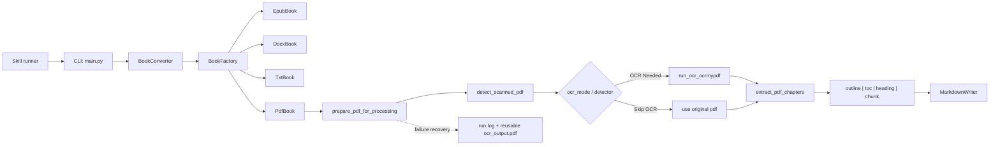
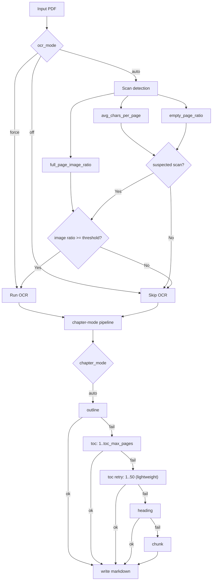

# book-transfer

`book-transfer` 用于把 EPUB/PDF/DOCX/TXT 电子书拆分为按章节组织的 Markdown 文件，核心场景是 PDF 的稳健分章与 OCR 前置处理。

## 文档导航

- 使用指南（双语文件，已重写）：`USAGE_GUIDE.zh-CN.en.md`
- 系统架构：`docs/ARCHITECTURE.md`
- PDF 业务逻辑：`docs/BUSINESS_LOGIC.md`
- 开发与运维手册：`docs/DEVELOPER_RUNBOOK.md`
- TDD 规范：`docs/TDD_POLICY.md`
- Bash 版本差异：`BASH_VERSION.md`

## 核心能力

- 支持输入格式：`.epub` / `.pdf` / `.docx` / `.txt`
- 输出：按章节编号的 `.md` 文件
- PDF 章节策略：`outline -> toc -> heading -> chunk`（`auto` 下按此顺序降级）
- 扫描 PDF：OCR 自动判定（文本密度 + 空页比 + 整页主图像比）
- OCR 恢复：OCR 成功后下游失败时，保留可复用中间文件并返回路径
- Agent Skill：提供 `skills/book-transfer-converter`，可安装到 `~/.codex/skills`

## 快速开始

### 1) 安装

```bash
python3 -m venv .venv
source .venv/bin/activate
pip install -r requirements.txt
```

### 2) 基础转换

```bash
.venv/bin/python main.py convert ./test_book.txt -o ./output_md
```

### 3) PDF（自动策略）

```bash
.venv/bin/python main.py convert /path/to/book.pdf -o /path/to/out --chapter-mode auto --ocr auto
```

## CLI 参数

```bash
.venv/bin/python main.py convert <input_file> [OPTIONS]
```

- `--outdir, -o`：输出目录，默认 `output_md`
- `--chapter-mode`：`auto|outline|toc|heading|chunk`，默认 `auto`
- `--ocr`：`auto|force|off`，默认 `auto`
- `--ocr-lang`：默认 `chi_sim+eng`
- `--keep-intermediate`：成功结束后是否保留中间文件
- `--chunk-words`：分块模式词数阈值，默认 `4000`
- `--toc-max-pages`：TOC 首轮扫描深度，默认 `30`（内部可扩展到 `50`）

## 系统架构图（Mermaid）



## PDF 业务流程图（Mermaid）



## 测试与质量门禁

- 全量测试：

```bash
.venv/bin/pytest -q
```

- 覆盖率门禁（>=90%）：

```bash
.venv/bin/pytest --cov=main --cov=book_converter --cov=pdf_processing --cov=ocr_utils --cov=chapter_utils --cov-fail-under=90 -q
```

- CI：`.github/workflows/ci.yml`

## Skill 安装

```bash
bash scripts/install_skill.sh
```

安装后目录：`~/.codex/skills/book-transfer-converter`

