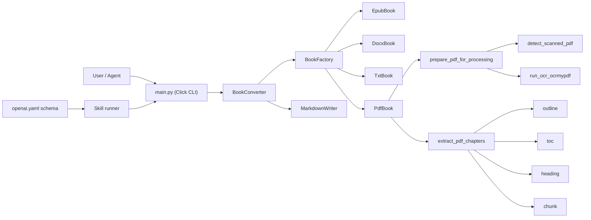

# 系统架构说明

## 1. 目标

本文档描述 `book-transfer` 的系统边界、模块职责、调用链路与扩展点。

## 2. 模块分层

- 入口层：`main.py`
- 编排层：`book_converter.py`
- PDF 处理层：`pdf_processing.py`
- OCR 能力层：`ocr_utils.py`
- 通用工具层：`chapter_utils.py`
- Agent 调用层：`skills/book-transfer-converter/*`

## 3. 架构图（Mermaid）

## 4. 关键职责

### 4.1 `main.py`

- 暴露 `convert` 命令。
- 做参数类型与取值约束（click enum/int range）。

### 4.2 `book_converter.py`

- 根据文件扩展名选择对应 `Book` 实现。
- `PdfBook` 只负责流程编排，不承载细节策略。
- 统一交给 `MarkdownWriter` 输出章节文件。

### 4.3 `pdf_processing.py`

- OCR 前置流程编排（准备、收尾、恢复提示）。
- PDF 章节提取策略及自动降级。
- TOC 解析与自适应深度扫描。

### 4.4 `ocr_utils.py`

- 扫描件判定（文本特征 + 图像特征）。
- OCR 命令执行与依赖检查。

### 4.5 Skill 层

- `agents/openai.yaml` 负责输入 schema 约束。
- `scripts/run_book_transfer.sh` 负责二次校验和安全命令构造。

## 5. 失败恢复设计

- OCR 运行在系统临时目录（`book-transfer-*`）。
- 下游异常时保留 `ocr_output.pdf`，并打印可复用绝对路径。
- `run.log` 记录异常与 traceback。

## 6. 扩展建议

- 新增格式：在 `BookFactory` 注册新的 `Book` 子类。
- 新增 PDF 策略：在 `extract_pdf_chapters` 插入新策略并补充降级测试。
- 新增 OCR 引擎：在 `ocr_utils.py` 增加 runner 并保持接口兼容。

