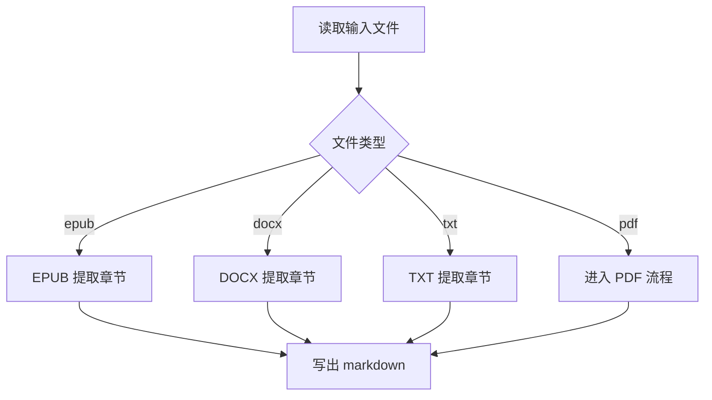
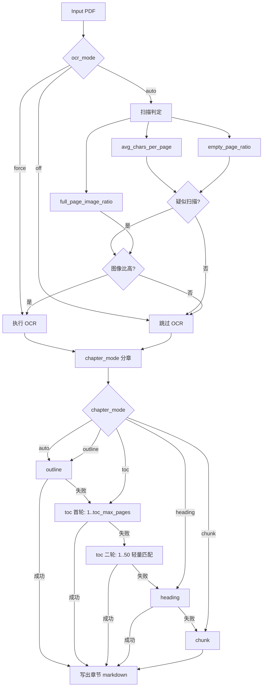
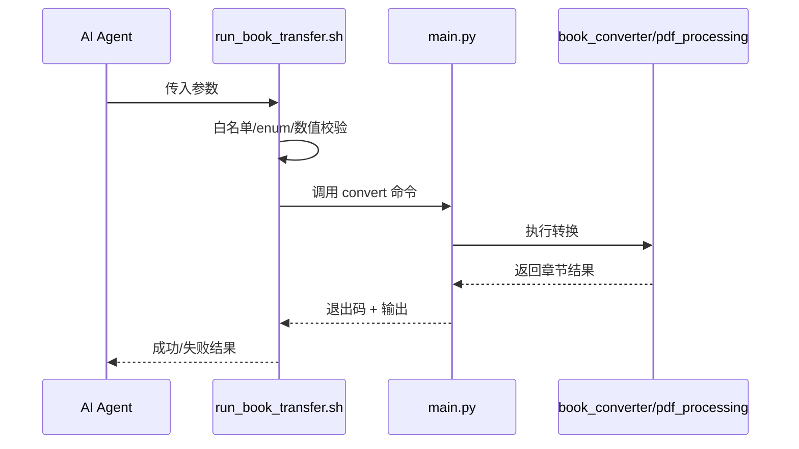

# 业务逻辑说明（重点：PDF）

## 1. 总体处理流程

## 2. PDF 核心业务流程

## 3. 关键业务规则

### 3.1 OCR 决策规则

- 强制模式：`--ocr force`，无条件 OCR。
- 关闭模式：`--ocr off`，无条件不 OCR。
- 自动模式：先看文本稀疏性，再看整页主图像比例，避免把“图文混排但非扫描件”误判为扫描件。

### 3.2 TOC 自适应规则

- `toc` 首轮扫描 `1..toc_max_pages`。
- 未命中时扩展至 `1..50`，并采用轻量过滤（只快速识别目录页特征）。
- 仍失败才降级 `heading`。

### 3.3 崩溃恢复规则

- OCR 成功后若下游失败：
  - 保留 `ocr_output.pdf`
  - 错误信息中输出可复用路径
  - `run.log` 落盘异常信息

## 4. Skill 业务调用逻辑

